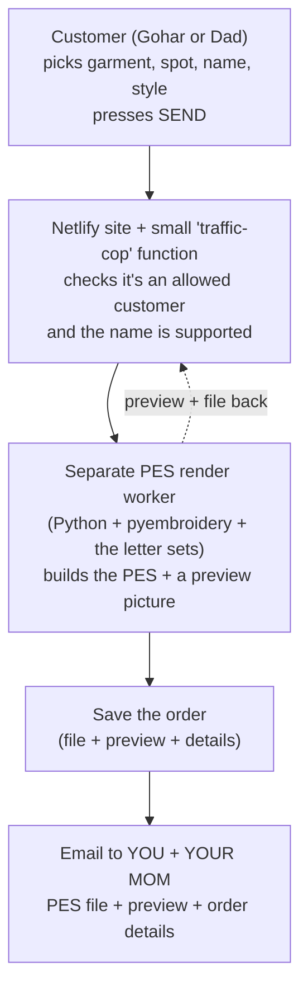

# Threadwell — Part 2: Languages & the Order Studio

*An addendum to the Threadwell blueprint. Part 1 designed the simple app that replaces the complicated embroidery software, so your mom can import a design, see it clearly, avoid "too big for the hoop" mistakes, and save a machine-ready file to a USB stick for her Baby Lock Destiny.*

Part 2 adds the two things you just asked for. **First**, real support for stitching **names in three languages — Armenian, Spanish, and English — in both plain PRINT and flowing CURSIVE.** **Second**, a future **online order page (the "Studio") where two trusted customers — Gohar and his dad — can type a name onto a garment and press Send, and the finished embroidery file lands in your inbox and your mom's.**

---

## The short version

Here are both new pieces in plain English, before any detail.

**The languages.** Think of it as **two alphabets, not three languages.** Spanish and English use the *same* letters (the Roman alphabet you're reading now) — Spanish just adds a few accented letters like **á é í ó ú ü ñ** and the upside-down marks **¿ ¡**. So one good Latin lettering set covers both. **Armenian is the genuinely separate, special one** (Գոհար). Almost no embroidery software — including the expensive FTC-U your mom uses now — supports Armenian at all. Making Armenian work well is the standout feature of this whole project. Within each language we offer **two looks: PRINT (separate block letters, the easy and reliable one) and CURSIVE (joined-up script, the pretty but harder one).**

**The order page ("Threadwell Studio").** A tiny, locked-down web page — not a design tool. Gohar or his dad opens a personal link, taps a garment (a shirt cuff, a collar, a jacket back, or the **white baby christening suit** — the "white cowboy outfit"), taps where the name should go, types the name in their language and style, sees a real preview, and presses one big green **SEND**. Behind the scenes the system builds the stitch file, makes a preview picture, and emails both to **you and your mom** — the two people who actually run the machine. The customer never touches a file, never sees jargon, and can't break anything.

The magic trick that makes both possible: **we build the "name → stitches" brain once, and both the app and the order page use it.**

---

## Writing names in three languages

### Why this is the special, hard part

Most of Part 1 was about *moving files around* safely — genuinely useful, but not rare. **Lettering is where this project becomes special**, because turning typed letters into good embroidery is real craft, and doing it in **Armenian** is something the mainstream tools simply don't do.

A quick reality check on the software world:

- **FTC-U** (your mom's current software) does English/Latin lettering, but **almost certainly has no Armenian** at all.
- **The Baby Lock Destiny's built-in fonts** (about 27 of them, baked into the machine) are Latin, maybe some Japanese and Cyrillic — **never Armenian**, and the set can't be added to.
- **Ink/Stitch** (the free, open-source stitch engine we're building on) ships fonts for Latin, Cyrillic, Greek, Hebrew, Arabic, and Japanese — **but no Armenian.**
- Even the specialty embroidery-font shops (the ones with huge Latin catalogs) basically **don't carry Armenian.** The only Armenian embroidery alphabets that exist are a handful sold by individual craftspeople on Etsy.

So "Armenian name embroidery" is a genuine gap in the market. **If Threadwell does it well, that is a real, defensible strength** — not a checkbox.

### The font matrix (what's realistic in each language and style)

Here's the honest map. Each cell gets a **quality** note (how good it can look) and a **feasibility** tag (how hard it is to build).

Feasibility tags:
- **Buildable now** — works with the free tools we already planned, minimal new work.
- **Moderate** — a one-time human build, then easy forever.
- **Hard R&D** — genuinely difficult; treat as a premium, later add-on.

| Language | Style | Quality | Feasibility | Plain-English note |
|---|---|---|---|---|
| **English** | **Print (block)** | Excellent, production-ready | **Buildable now** | The easiest case. Reliable down to about 4–5 mm letter height. The default "safe" path. |
| **English** | **Cursive (joined)** | Very good *if* we use a proper joined script font | **Buildable now** | Needs bigger letters (about 6 mm+). Uses ready-made script fonts, never on-the-fly conversion. |
| **Spanish** | **Print (block)** | Excellent, identical to English print | **Buildable now** | **Not a separate font** — the same Latin set as English, as long as it includes á é í ó ú ü ñ ¿ ¡. |
| **Spanish** | **Cursive (joined)** | Very good, same as English cursive | **Moderate** | Same script font; accent marks have to sit neatly above slanted joined letters, which is fussier. |
| **Armenian** | **Print (block)** | Good to very good once built by hand | **Moderate** | **The flagship.** Nothing off-the-shelf exists — we build the ~76-letter alphabet once from a free Armenian font, then it "just works." |
| **Armenian** | **Cursive (joined)** | The honest weak spot — possible but costly, larger sizes only | **Hard R&D** | Armenian letters don't auto-join, and the thin connectors are too skinny to stitch. A real premium, hand-built, big-size-only offering. |

**How to read this table:** four of the six cells are ready or nearly ready. Armenian **print** is a one-time investment that pays off forever. Armenian **cursive** is the one place where "good" costs real hand-labor — so we ship everything else first.

### Key insight: two alphabets, not three languages

> **Spanish and English are the SAME lettering.** Both use the Roman alphabet, so you don't need a "Spanish font" and an "English font" — you need **one Latin font that also covers the Spanish extras.** The whole requirement boils down to making sure these characters are present:
>
> - **Accented vowels:** á é í ó ú
> - **The u with two dots:** ü (as in *pingüino*)
> - **The ñ** — which is its own letter in Spanish, not "an n with a squiggle"
> - **The upside-down marks:** ¿ and ¡
>
> Once those exist, **English comes along for free** (English only uses a subset). The good news: every one of those Spanish characters has a single, standard computer code, so each can be a single ready-made stitched letter — no special tricks needed.
>
> **Armenian is the one that's truly separate.** Different alphabet, different letters, needs its own everything. That's where the real work — and the real bragging rights — live.

### The Armenian challenge

**The alphabet.** Modern Armenian runs from **Ա (Ayb)** to **Ֆ (Feh)** — 38 letters (36 original ones created around 405 AD, plus two added in the Middle Ages). It's **bicameral**, meaning every letter has an uppercase and a lowercase form, just like Latin — so a full working set is about **76 shapes** (38 × 2). That "76 letters, upper and lower case" is exactly what the niche Armenian embroidery sets on Etsy advertise.

**Two special forms we must handle carefully.** These are the classic tripwires:

| Form | What it is | Why it matters for stitching |
|---|---|---|
| **և** (the "ev" sign) | A **single** joined character (one computer code, U+0587) | Treated as one letter; needs its own single stitched glyph. |
| **ու** (the "u" sound) | **Two** letters written together: ո + ւ | It is *never* one character. Any name with a "u" sound in it needs **both** component letters in our set — miss either one and those names break. |

Since **"Gohar" (Գոհար)** is exactly the kind of name we're building this for, and countless Armenian names contain the "u" sound, **getting ու right is not optional.**

**Why connected Armenian cursive is the hardest of all.** Armenian has a beautiful centuries-old handwriting tradition (the slanted everyday cursive is called *sheghagir*). But two things make it very hard to stitch:

1. **The letters don't automatically join.** In digital Armenian fonts, each letter is a separate island — the software doesn't know to link one letter's tail to the next letter's start. A true joined look would have to be hand-built for *every pair* of letters.
2. **The connecting strokes are too thin.** Embroidery satin (the smooth filled stroke that makes a letter) breaks down below roughly **1 mm** wide — the thread bunches and won't hold. Cursive's delicate diagonal links fall right below that limit.

That's why every Armenian embroidery alphabet you can actually buy is **block/print, not cursive.**

**How we'd actually do Armenian.** The plan is a **one-time human build:**

1. Start from a **real, free Armenian font** — specifically **Noto Sans Armenian**, which is licensed (SIL Open Font License) for commercial use and embedding. (We avoid the fonts that come bundled with Windows or Mac — Sylfaen, Mshtakan — because their licenses restrict giving them away inside a product.)
2. Hand-digitize the ~76 letter shapes **once** into clean satin stitches — making sure to include the ու pieces and the և ligature — and package them as a reusable Threadwell/Ink-Stitch font.
3. After that build, **typing any Armenian name just works**, including Գոհար.

We ship **Armenian print first**, and treat Armenian cursive as a later premium option.

### Cursive is the hard one (in every language)

Print letters are easy for one simple reason: **each letter stands alone.** The machine stitches an "H," lifts, moves over, stitches an "i" — no relationship between them.

Cursive is hard because **the letters have to actually touch and flow into each other.** That means the software has to:

- **Overlap the joins slightly** so there's no gap where two letters meet.
- **Line up the tails**, not just the bottoms, so it looks like one continuous handwritten line.
- **Adjust the spacing for every specific letter pair** — the right gap after an "o" going into an "o" is different from an "r" going into an "s," because it depends on where the previous letter's tail exits and the next letter's stroke enters.
- **Keep one clean stitching path** so the machine doesn't awkwardly cut the thread and jump in the middle of a word.

Because of all this, **good cursive fonts are hand-made by a person**, and cursive needs **bigger letters** than print (roughly 6 mm+ for Latin, 8 mm+ for anything ornate or for Armenian) so those delicate connections don't clog up. **This is why we always use ready-made, hand-digitized script fonts for cursive — never automatic, on-the-spot conversion.**

### How your mom (or a customer) types a name

Same friendly design language as Part 1: **big tiles, big letters, near-black on white, green only for the "go" button, and "you truly cannot break it."** One big decision per screen, no dense forms. The flow is: **pick language → pick style → type → pick size & spot → preview → go.**

**1) Pick the language.** Three huge tiles — **English**, **Español**, **Հայերեն (Armenian)** — each showing the name pre-drawn in that script, so she recognizes it by *shape*, not by reading a label.

**2) Pick the style — the single biggest control.** One enormous **PRINT vs CURSIVE** toggle, with two sample tiles showing the *same* word both ways (e.g. Գոհար in block and in script), so the choice is visual, not verbal.

**3) Type the name**, with a giant live preview above the box that updates as she types.

- **English / Spanish:** the normal keyboard — the **computer's keyboard** in your mom's Windows desktop app, or the phone keyboard when a customer uses the Studio. For Spanish, the accented letters (á é í ó ú ü ñ) and the ¿ ¡ marks appear as **big one-tap on-screen chips** right by the text box, so she never has to hunt or know long-press tricks.
- **Armenian — three ways, easiest first:**

| Way | How it works | Who it's for |
|---|---|---|
| **Phonetic (default)** | She types **"Gohar"** on the normal keyboard and it auto-converts to **Գոհար** live above the box (G→Գ, o→ո, h→հ, a→ա, r→ր). A small **Eastern/Western** dialect toggle handles the fact that some sounds map to different letters; we remember her choice. | The easiest path for anyone who doesn't type Armenian. |
| **Saved names** | A tap-list of names she's stitched before plus common Armenian names — **zero typing**, just tap Գոհար. | The everyday shortcut. |
| **On-screen Armenian keyboard** | A big-key Armenian layout. | Advanced users only. |

**4) Size & placement — no numbers.** A big slider with three labeled stops — **Small / Medium / Large** — each showing the real millimeter height. If a choice drops below the safe minimum for that style (print ~4–5 mm, cursive ~6 mm+, Armenian cursive ~8 mm+), the tile turns **amber** and offers "make it bigger" — never a cryptic error. Placement is chosen by **tapping a spot on a big picture** of the item, not by typing coordinates. The Part 1 hoop-fit check still blocks "too big for the hoop" the same gentle way.

**5) Preview & go.** A full-screen, accurate stitch preview on a plain background, then **one green "Save / Make File" button.** Everything before it is reversible; only the final action is green.

### Under the hood: how typed text becomes a PES

Three honest layers turn a typed name into a machine file. The core rule: **the file-writing tool (pyembroidery) has zero ability to draw letters** — it only writes the finished stitch coordinates into the PES format. So the letter shapes have to be produced *before* it.

**Layer 1 — where the letter shapes come from.** Two paths:

- **(A) Ready-made, hand-digitized letters (the default, best quality).** Each letter is drawn once by a human with proper satin, underlay (the hidden stabilizing stitches underneath), density, and stitch path. Latin covers English + Spanish; Armenian uses our one-time ~76-letter build.
- **(B) On-the-fly conversion from a regular font outline (a fallback only).** For a rare letter we haven't hand-built yet, the software can try to convert a standard font shape into satin. **Honest caveat:** a font's outline is a hollow shape (an outline around each stroke), not a center-line, so clean results still need a human to place the stitches. **This is draft quality, clearly labeled — never the headline path, especially for Armenian.**

**Layer 2 — laying out the word.** Print letters go side by side. Cursive letters overlap at the joins, align their tails, and get per-pair spacing, with one clean stitching path so there are no mid-word thread cuts. A few technical guardrails baked in: satin wants strokes about **1.5 mm and up**; underlay is chosen by stroke width (a simple center line for skinny strokes, an outline-tracing run for normal letters, a zigzag added for wide ones); and for Spanish, the little accent marks are separate stitched pieces, so we **force "lock stitches" on them** so they don't unravel when the machine trims the thread.

**Layer 3 — writing the file.** The stitch geometry is handed to **pyembroidery**, which writes a proper **PES** file with the thread colors baked in (exactly what the Destiny needs), ready to copy to the FAT32 USB stick from Part 1.

**The honest bottom line: hand-digitized always looks better than auto-converted, and the gap is widest for Armenian.** Our strength comes from doing the careful hand-work **once per language**, after which anyone can just type a name.

---

## Threadwell Studio — the order portal for Gohar & his dad

### The vision, in plain English

**Threadwell Studio is a tiny, locked-down ordering page — not a design tool.** It's the customer-facing front door to the *same* system your mom uses, and it deliberately hides everything hard.

Gohar and his dad each get a **personal sign-in link**. They open it and get a **five-tap flow**: pick a garment, tap where the name goes on a picture of it, type the name (Armenian / Spanish / English, print or cursive), see a real stitch preview, and press one big green **SEND**. On Send, the system quietly builds the machine-ready file, makes a preview picture, and **emails the file + preview + order details to you and your mom.** The customer never sees the word "PES," never sees a scary error, never installs anything. **You truly cannot break it.**

### The garment & placement catalog

| Garment | Where the name can go |
|---|---|
| **Shirt cuffs** (dress/casual) | Right cuff · Left cuff · Both cuffs |
| **Shirt collar** | Inside band (hidden monogram) · Left point · Right point · Back of the collar (nape) |
| **Chest** (shirt or polo front) | Left chest (the classic monogram spot) · Center chest · Right chest |
| **Jacket back** | Full upper back (big arched name) · Center back yoke · Left shoulder blade · Nape |
| **Baby onesie / bodysuit** | Center chest · Left chest · Bottom front (snap flap) · Upper back |
| **Baby baptism / christening suit** — the white boys' outfit you call the **"white cowboy outfit"** | **Jacket back** (the showcase — name arched large) · Left chest (keepsake initials) · Collar / lapel · Front bib / vest panel · Hat or bonnet band · Bootie or sleeve cuff (tiny initials) |

### The customer's journey, screen by screen

| Step | Screen | What the customer does |
|---|---|---|
| **1** | **Sign in** | Opens their personal link from email. One tap in — no password, no account to create. Greeted by name: "Hi Gohar." One big button: **START AN ORDER.** |
| **2** | **Choose garment** | A grid of **big photo tiles** — cuffs, collar, chest, jacket back, onesie, christening suit. Taps one. Real pictures, big labels, one screenful. |
| **3** | **Choose the spot** | A large photo of that garment with tappable **green dots** at sensible spots (for the christening suit: jacket back, left chest, collar). Taps a dot; it highlights and labels itself ("Jacket back"). |
| **4** | **Type the name** | Three big language buttons (Հայերեն / Español / English) swap the script and keyboard; two big style buttons (PRINT / CURSIVE); a huge text field. Only supported letters can be typed, so nothing broken gets entered. |
| **5** | **Preview** | An accurate stitch preview of the real name, **on the garment photo at the chosen spot, at true relative size.** If it's too big for the hoop, the app doesn't scold — it quietly fits it and, only if needed, notes "made a little smaller to fit." Buttons: **CHANGE** or the one green **SEND.** |
| **6** | **Sent** | Taps SEND once. Friendly confirmation: **"Order sent! Your design is on its way."** No files, no downloads for the customer. You and your mom get the email. |

### What happens when they press Send

Here's the pipeline in plain terms. On **SEND**, the system:

1. **Checks** the order is valid and the signed-in person is one of the two allowed customers, and that every letter is one we support.
2. **Builds the stitch file** — a separate "render worker" loads the ready-made letters for that language + style, lays out and spaces the name, auto-fits it to the hoop, and writes a machine-safe **PES**.
3. **Makes a matching preview picture** from the exact same stitches (so the preview equals reality).
4. **Saves the order** — the file, the preview, and a small record (order number, time, who ordered, garment, spot, name, language, style, size).
5. **Emails one message to both of you** — you (baghb004@gmail.com) **and** your mom — attaching the tiny PES file plus the preview, with the order details in the body.
6. **Shows the customer** the friendly "Order sent!" screen.

### How it's actually built (honestly)

This part is very doable, but it's worth being straight about **where the difficulty really is** — because the naive pitch ("a Netlify function types a name into a PES and emails it") hides the one genuinely hard piece.

**The two easy parts** (these fit comfortably on Netlify):
- **The website itself** — a simple static page of big tiles and one green button, hosted on Netlify. Cheap, reliable, easy.
- **Emailing the finished file** — PES files are only *kilobytes*, so attaching one to an email to two people is trivial.

**The one hard part:** turning a typed name into *good* stitches. That needs the letter-drawing engine, and **that engine does not fit inside a Netlify function.** The reference tool (Ink/Stitch) needs a full Inkscape install — hundreds of megabytes and a graphical environment — which blows past Netlify's function size limit (about 50 MB zipped) and its short-lived nature. Even the lighter approach (ready-made letters + pyembroidery) is a Python job, and Netlify functions run small Node.js snippets.

**So the honest architecture is a split:**

| Piece | What we use | Why |
|---|---|---|
| **Website (front end)** | Static site on **Netlify** (works as an iPhone web-app) | The UI is just a few big-tile screens. Easy, cheap, reliable. |
| **Traffic cop (API)** | A **thin Netlify function** | Checks who you are, validates the order, calls the worker, saves the order, sends the email. It does *not* do the stitch work. |
| **The real engine (render worker)** | A **separate small Python service** (on Fly.io, Render, or Railway) running pyembroidery + the letter sets | This is the same "name → stitches" brain the app uses. It's a Python job and won't fit in a Netlify function, so it lives on its own. |
| **Email** | A proper email service (**Resend / SendGrid / Postmark**) from a verified domain | Gets the message into the inbox (not spam), and sends to you + your mom in one go. Tiny PES attaches with room to spare. |
| **Order storage** | **Netlify Blobs** for a simple start (or **Supabase** if you want a searchable order history) | Holds the file + a small order record, keyed by order number. |

**One timing note:** building a short name is fast, but the worker can occasionally be slow to "wake up." If a request risks running long, the Send step either runs as a **background job** (which can take up to 15 minutes) or hands back an order number the page checks on — so nothing ever times out and fails in the customer's face. **None of this is blocked or exotic — it's a standard, well-trodden setup. The reality check is just: don't try to cram the embroidery engine into the website's little function; give it its own home.**

### Only Gohar and his dad get in

**Exactly two customers, and no one else.** The plan:

- **Passwordless "magic-link" sign-in** (via Supabase): each customer clicks a one-time link mailed to their own address. No passwords to create, lose, or manage.
- **A hard two-email allowlist.** Only Gohar's and his dad's email addresses are permitted, enforced on the server. If any other address tries, it's rejected. The Send step **re-checks** the allowlist before it will build or email anything, so a stray or forged request can't trigger a design.
- **Every order is stamped** with which customer placed it (an audit trail) — something a single shared password can never give you.
- **The recipients are locked server-side.** The email always goes to you + your mom as fixed constants; the customer can never redirect it elsewhere, so the page can't be abused as a mailer.
- **Secrets stay hidden.** All the sensitive keys live on the server, never in the web page. Incoming name text is treated as untrusted and cleaned up. Send is rate-limited per customer to blunt abuse.

**Two fair-warning caveats about magic links** (worth knowing, low-risk for two personal Gmail users): some corporate email scanners can "click" a one-time link before the person does and use it up; and anyone with momentary access to a customer's inbox could sign in — so the link is a key. A single shared code is fine **only** as a throwaway first-week gate, not as real security. Worth a quick check with Gohar and his dad that email sign-in suits them.

> **Note on the automatic email.** Because pressing Send makes the system **send mail on your behalf** to you and your mom, in the real build that email step should go through a clear confirm ("send this order?") rather than firing silently — the same careful, human-in-the-loop habit from Part 1.

### The build plan

| Phase | What gets built | Effort / honesty |
|---|---|---|
| **0 — Decisions & fonts (the gate)** | Lock the small set of licensed fonts (Armenian, Spanish/Latin, English — print + cursive). **Hand-build the ~76 Armenian letters once.** Verify each font's license allows commercial output. Confirm hoop sizes and the two customer emails. | **The real cost center.** Armenian digitizing is human letter-by-letter work — budget weeks or a commission. Everything downstream depends on this. |
| **1 — The shared engine** | The Python render worker: name + language + style + size in → machine-safe PES + preview out. **Stitch-test on the actual Destiny.** This same engine also powers the mom app. | Substantial custom work — the single most valuable, most reused piece. |
| **2 — Portal + garments** | The Netlify static site: the five-tap flow, garment photos with correct tappable placement dots, preview wired to the real engine. | Moderate. The UI is small; the care is good photos and correct spots. |
| **3 — Send pipeline** | The Netlify traffic-cop function: validate → call worker → save order → email PES + preview + details to you + mom. Handle slow jobs with a background function or polling. | Moderate. Email + storage are easy; care goes into secrets and the two-recipient lock. |
| **4 — Access control** | Magic-link sign-in with the two-email allowlist, server-side re-check, rate-limiting, verified sending domain. | Light-to-moderate; well-trodden patterns. |
| **5 — Pilot** | Live test: Gohar orders his own name in Armenian (Գոհար) on the christening suit's jacket back; his dad places an order too. Confirm the emailed file stitches cleanly and previews match. | Light build, real validation. Budget a round of letter cleanup after the first real stitch-outs. |

---

## One engine, two front doors

The single most important idea to hold onto: **there is only ONE "name → stitches" brain, and it's built once.**

- **Front door #1 — your mom's Threadwell app** — the **native Windows desktop/laptop program** she runs on the computer (from Part 1, now with lettering): she taps *Add a Name*, picks language and style, types, sizes, previews, and saves a PES to her USB stick.
- **Front door #2 — the Studio order page** — the **website on Netlify** that Gohar or his dad opens in a browser: they pick a garment and spot, type a name, preview, and press Send — and the email arrives.

> **Platform note (your clarification):** the *engine itself* is plain Python code, so it doesn't care where it runs. That's exactly why it can sit **inside the Windows desktop app** for your mom **and** on the **render worker** behind the Netlify website for customers — same brain, two homes.

Both doors open into the **same** engine: the pre-digitized Armenian/Spanish/English letter sets, the same print-and-cursive layout logic, the same pyembroidery step that writes the PES with colors intact. The Studio just wraps a **garment + placement layer** and an **email step** around it.

**Why this matters to you:** the hard, expensive work — especially building Armenian — happens **once**, and both experiences get better together. Improve a letter for the order page, and your mom's app improves too.

---

## Honest limitations & what to build first

Straight talk, no sugar-coating:

**What's genuinely easy and low-risk (do it first):**
- **English and Spanish, print and cursive.** One shared Latin font family. The only real task is confirming it covers á é í ó ú ü ñ ¿ ¡ and forcing lock-stitches on the little accents. **Buildable now.**
- **The order-portal skeleton** — the Netlify site, the five-tap flow, the email step. Standard web work, nothing blocked.

**The one-time investment that becomes a real strength:**
- **Armenian PRINT.** Nothing off-the-shelf exists, so we hand-build the ~76 letters once from Noto Sans Armenian (handling ու and և), then Armenian names — including Գոհար — just work forever. **This is the feature that makes Threadwell special.**

**The genuine challenge (be candid, treat as premium):**
- **Armenian CURSIVE.** Armenian letters don't auto-join, and the delicate connectors fall below the minimum stitchable width. Real joined Armenian script means hand-building each letter pair, at larger sizes only (~8 mm+). **Ship it later, as a premium, hand-crafted option — don't promise machine-perfect small Armenian cursive.**
- **Auto-conversion of any font** in general is "hit and miss" and worst exactly where Armenian lives. So auto-conversion is only ever a rough draft, clearly labeled — anything a real customer will wear goes through the hand-built letters.

**The concrete recommended first step:**

> **Build the shared "name → stitches" engine for Latin (English + Spanish), print and cursive, and prove it end-to-end** — type a name, generate a PES, and stitch it out on your mom's Destiny to confirm it looks right. That's the low-risk core that both front doors need.
>
> **In parallel, kick off the one-time Armenian print build** (commission it or hand-digitize the ~76 letters from Noto Sans Armenian). That's the long-lead item and the true differentiator, so start it early.
>
> Save **Armenian cursive** and the fancy extras (handwriting-to-stitch, on-garment AR preview) for after the core is real and working.

Do those two things, and you have a working multilingual lettering app for your mom **and** the foundation of Gohar's order page — with Armenian, the part nobody else does, as the standout.
